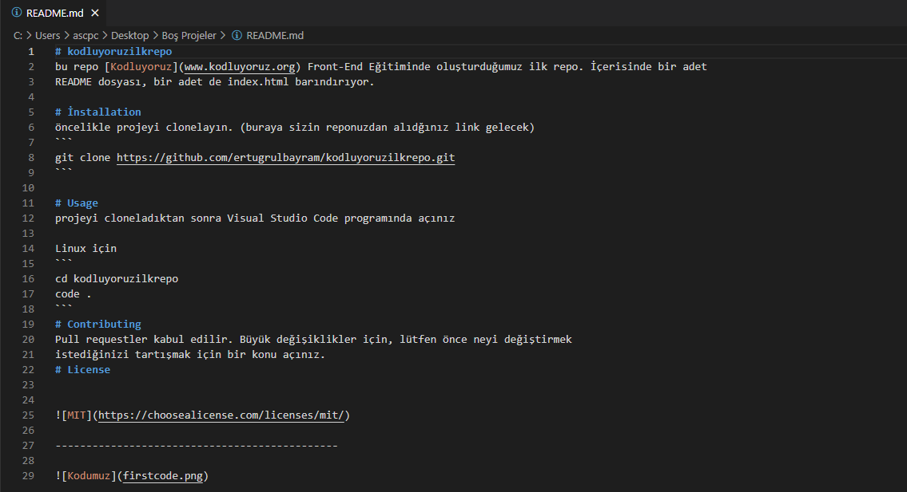

# kodluyoruzilkrepo
bu repo [Kodluyoruz](www.kodluyoruz.org) Front-End Eğitiminde oluşturduğumuz ilk repo. İçerisinde bir adet
README dosyası, bir adet de index.html barındırıyor.

# İnstallation 
öncelikle projeyi clonelayın. (buraya sizin reponuzdan alıdğınız link gelecek)
```
git clone https://github.com/ertugrulbayram/kodluyoruzilkrepo.git
```

# Usage 
projeyi cloneladıktan sonra Visual Studio Code programında açınız

# Linux için
```
cd kodluyoruzilkrepo
code . 
```
# Contributing
Pull requestler kabul edilir. Büyük değişiklikler için, lütfen önce neyi değiştirmek 
istediğinizi tartışmak için bir konu açınız.
# License 


[MİT](https://choosealicense.com/licenses/mit/)

----------------------------------------------

